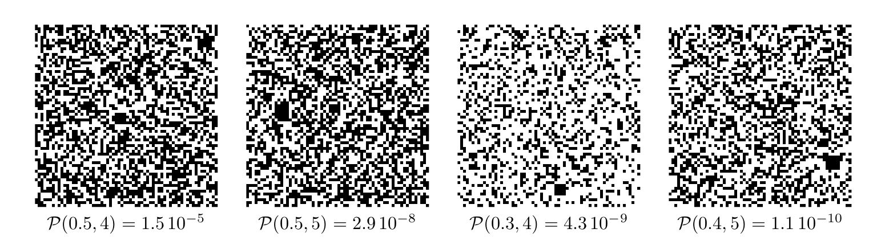
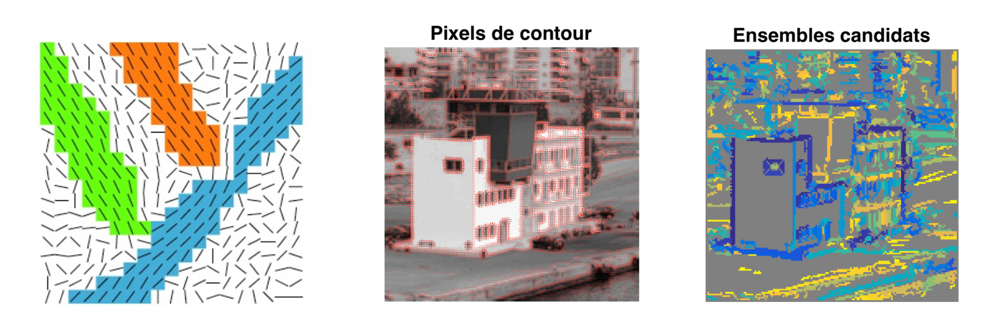

# TP3 – Perception des formes dans une image

## Introduction
Dans une image binaire de synthèse, on considère les pixels comme des variables aléatoires iid. Un pixel reçoit la valeur ``0(\text { pixel noir })`` avec la probabilité ``p`` ou la valeur 1 (pixel blanc) avec la probabilité ``1-p(``loi de Bernouilli de parametre ``p`` ). Malgré l'indépendance entre pixels, des agglomérats de pixels noirs, en forme de carrés, peuvent apparaítre par le fait du hasard. La probabilité ``\mathcal{P}(p, t)`` pour qu'un carré de côté ``t`` soit noir est égale à ``p^{t^{2}}``. Elle diminue très rapidement si les carrés deviennent plus grands, c'est-à-dire lorsque ``t`` croít, ou sì les pixels noirs se raréfient, c'est-à-dire lorsque ``p`` décroít. Or, un carré noir se distingue d'autant mieux qu'il est plus grand ou que l'image est plus claire (cf. figure 1). Cet exemple très simple illustre le principe général de la perception des formes dans une image : une forme est d'autant plus perceptible qu'elle est moins probable.

FIGURE 1- Chacune de ces images binaires de taille ``64 \times 64,`` tirées selon une loi de Bernouilli de paramètre ``p`` contient un carré noir unique de côté ``t=5 .`` La probabilité d'apparition ``\mathcal{P}(p, t)=p^{t^{2}}`` du carré décroít de gauche à droite, ce qui le rend de plus en plus perceptible : notre ceil est attiré par les événements les moins probables!

Lancez le script *carres_noirs*, qui simule une séquence d'images binaires aléatoires de taille ``64 \times 64`` tirées selon une loi de Bernouilli de paramètre ``p,`` jusqu'à ce qu'une de ces images contienne au moins un carré noir de côté ``t .`` Ce script teste plusieurs valeurs de ``t,`` pour ``p=0,5`` fixé. Attention : la recherche est de plus en plus longue, puisque la probabilité d'apparition ``\mathcal{P}(p, t)=p^{t^{2}}`` d'un carré noir décroít fortement lorsque ``t`` croít. Néanmoins, plus l'attente est longue, plus la forme *"saute aux yeux"* dans l'image affichée.

Comme cela a déjà été vu dans le TP1, les variables aléatoires que constituent les pixels d'une image naturelle ne sont pas iid, mais sont au contraire fortement corrélées. C'est la raison pour laquelle les formes perceptibles sont beaucoup plus courantes dans une image naturelle que dans une image aléatoire. En revanche, il s'agit en général de formes approchées. Il est donc nécessaire de donner une définition plus souple à la notion de forme. Dans une image binaire aléatoire de taille ``T \times T`` tirée selon une loi de Bernouilli de paramètre ``p``, la probabilité pour qu'un carré de côté ``t,`` c'est-à-dire constitué de ``N=t^{2}`` pixels, contienne exactement ``n \leqslant N`` pixels noirs, est donnée par la loi binomiale ``\mathcal{B}(p, N, n)=\mathrm{C}_{N}^{n} p^{n}(1-p)^{N-n},`` où ``\mathrm{C}_{N}^{n}`` désigne le nombre de combinaisons de ``n`` éléments parmi ``N``. Par conséquent, la probabilité pour qu'un tel carré contienne au moins ``n`` pixels noirs s'écrit :

``\hspace*{2.5cm}`` ``\sum_{k=n}^{N} \mathcal{B}(p, N, k)=\sum_{k=n}^{N} \mathrm{C}_{N}^{k} p^{k}(1-p)^{N-k}=1-\sum_{k=0}^{n-1} \mathrm{C}_{N}^{k} p^{k}(1-p)^{N-k}`` ``(1)``
La dernière somme de (1) peut se calculer à l’aide de la fonction binocdf de Matlab (doc binocdf)

## Exercice 1 : détection de pixels voisins ayant des gradients parallèles

Détecter les *"alignements"* dans une image consiste à faire une esquisse constituée de segments de droites. De tels segments se situent là où le module ``\|\nabla I\|`` du gradient du niveau de gris ``I`` est élevé. Pour détecter les alignements, il faut donc commencer par calculer le gradient du niveau de gris ``\nabla I``, par exemple avec la fonction gradient (axe des abscisses orienté vers la droite, axe des ordonnées vers le bas, unité de longueur ``=`` pixel ). Une fois ce gradient calculé, seuls les pixels où sa norme est supérieure à un seuil sont sélectionnés. Parmi ces pixels, on cherche à constituer des ensembles ``E`` (cf. figure 2-gauche) tels que :
* chaque ensemble ``E`` soit connexe, au sens des *"8 plus proches voisins"*
* le gradient ``G_{i, j}=\nabla I(i, j)`` en un pixel ``(i, j)`` de ``E`` soit parallèle à la somme ``G_{\Sigma}`` des gradients calculée sur les pixels de l'ensemble ``E`` en cours de construction, c'est-à-dire ``\frac{G_{i, j}}{\left\|G_{i, j}\right\|} \cdot \frac{G_{\Sigma}}{\left\|G_{\Sigma}\right\|} \geqslant \cos \alpha,`` où ``\alpha>0`` désigne l'angle maximal autorisé entre les vecteurs ``G_{i, j}`` et ``G_{\Sigma}`` Après avoir lu attentivement le script exercice_1, complétez la fonction recursion, qui permet de construire, par appels récursifs, les ensembles ``E`` à partir de k "germes". Les figures 2 -centre et 2 -droite montrent le résultat de l'exécution de ce script sur l'image *Piree.png* (les ensembles ``E`` sont affichés sous différentes couleurs).

**Remarque** – Les fonctions ind2sub et sub2ind de Matlab sont très utiles : consultez leur documentation.

Figure 2 – À gauche : exemple comportant trois ensembles candidats ``E``. Au centre : image sur laquelle le
gradient du niveau de gris est superposé aux pixels de contour. À droite : ensembles candidats ``E`` associés.

## Exercice 2 : détection des alignements dans une image

Si la variable aléatoire *"gradient du niveau de gris"* en un pixel suivait une loi uniforme, la probabilité ``p`` pour qu'une réalisation fasse un angle inférieur à ``\alpha``, relativement à une direction de réference, vaudrait ``p=\frac{2 a}{2 \pi}=\frac{a}{\pi}`` Soit ``E`` un des ensembles de pixels constitués à l'étape précédente. On définit ``R`` comme le plus petit rectangle englobant de ``E,`` de cótés parallèles aux axes principaux de sa matrice d'inertie. Cette matrice est une généralisation de la matrice de variance/covariance, pour laquelle les coordonnées ``\left(x_{i}, y_{i}\right)`` sont pondérées par ``\pi_{i}=\|\nabla I\|_{i}``

``\hspace*{2.5cm}`` ``\bar{x}=\frac{1}{\Pi} \sum_{i=1}^{n} \pi_{i} x_{i} ;\\ \hspace*{2.5cm} \bar{y}=\frac{1}{\Pi} \sum_{i=1}^{n} \pi_{i} y_{i} ;\\ \hspace*{2.5cm} M_{1,1}=\frac{1}{\Pi} \sum_{i=1}^{n} \pi_{i}\left(x_{i}-\bar{x}\right)^{2} ;\\ \hspace*{2.5cm} M_{1,2}=\frac{1}{\Pi} \sum_{i=1}^{n} \pi_{i}\left(x_{i}-\bar{x}\right)\left(y_{i}-\bar{y}\right) ; \text { etc. }``

où ``\Pi=\sum_{i=1}^{n} \pi_{i} .`` Écrivez la fonction matrice_inertie, qui doit retourner les coordonnées ``(\bar{x}, \bar{y})`` du centre d'inertie de ``E`` et sa matrice d'inertie ``M,`` puis lancez le script test_matrice_inertie en guise de vérification. Une fois le rectangle ``R`` déterminé, on compte le nombre ``n`` de pixels ``(i, j)`` de ``E`` où ``\nabla I(i, j)`` fait un angle inférieur à ``\alpha`` avec la direction du petit axe de ``R``. La probabilité pour que cela se produise en ``n`` pixels de ``R`` au moins est donnée par ``(1),`` où ``p=\frac{\alpha}{\pi}`` et ``N=\operatorname{card}(R) .`` Le critère pour déterminer si un ensemble candidat ``E`` forme un alignement détectable s'écrit donc ``(\epsilon \ll 1`` est un seuil)

``\hspace*{2.5cm}`` ``1-\sum_{k=0}^{n-1} \mathrm{C}_{N}^{k} p^{k}(1-p)^{N-k}<\epsilon``

Écrivez la fonction calcul_proba, qui doit calculer le premier membre de (3) (le nombre de pixels ``N`` doit être entier!). Une fois mis au point sur l'image Piree.png, vous pourrez tester ces deux scripts sur les images chaises.png et Morlaix.png (le calcul est un peu long), ou sur toute autre image de votre choix.